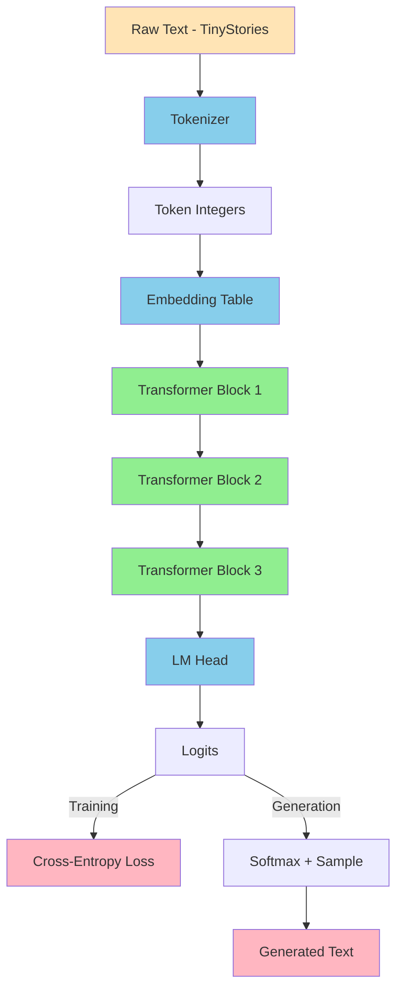
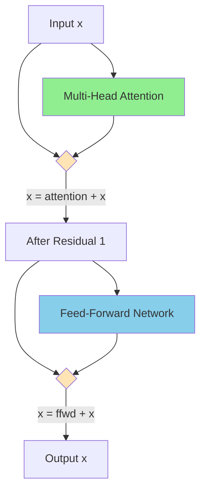
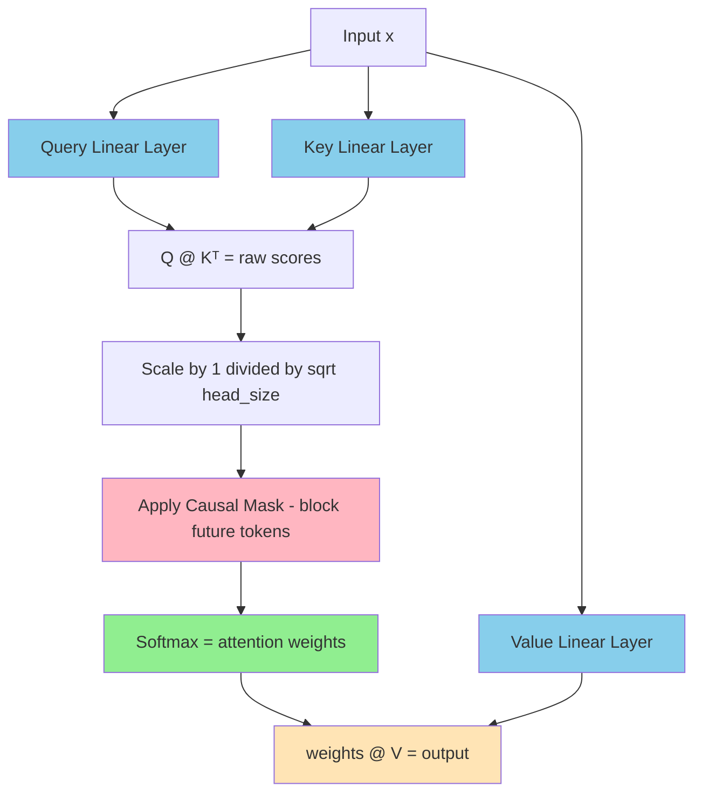
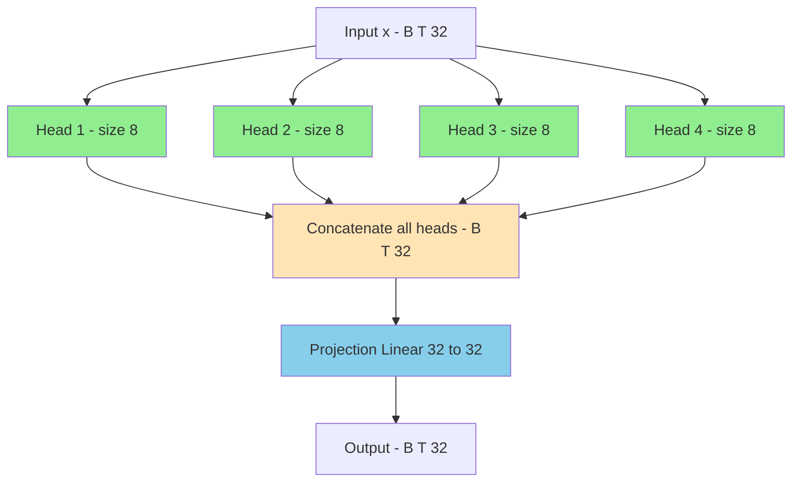
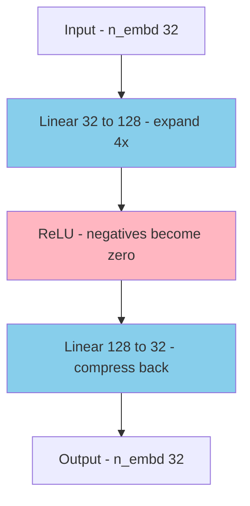
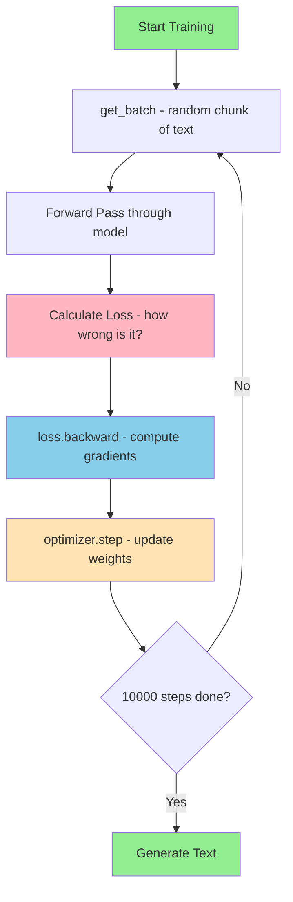

# LLM From Scratch

> Building a character-level Transformer Language Model from zero, in Python and PyTorch.  
> No APIs. No shortcuts. Every component written and understood from the ground up.

---

## What Is This?

This is a student project that builds a working Language Model from scratch, following Andrej Karpathy's "Let's Build GPT" as a learning backbone.

The goal is not just to run a model — but to understand every single component: how text becomes numbers, how attention works, how the model learns, and how it generates new text.

Long-term target: fine-tune this into a small, fully local personal assistant that runs entirely on-device. No data leaves the machine.

---

## Full Model Pipeline



---

## Transformer Block



---

## Self-Attention (Single Head)



---

## Multi-Head Attention



---

## Feed-Forward Network



---

## Training Loop



---

## Loss Progress

| Stage | What Was Added | Loss |
|---|---|---|
| Start | Random weights, no training | ~4.90 |
| Chapter 3 | Bigram model baseline | ~4.90 |
| Chapter 5 | Training loop + optimizer | ~2.30 |
| Chapter 6 | Single-head self-attention | ~2.25 |
| Chapter 7 | Multi-head attention (4 heads) | ~2.21 |
| Chapter 8 | Feed-forward layer | ~2.05 |
| Chapter 9 | 3× Transformer blocks + residuals | ~1.55 |

---

## Generated Output Progress

**Before training — pure noise:**
```
!pdL.6œXw¡Vx!!BE4E«V-©;0Fœq!R g T˜Fu
```

**After training, no attention:**
```
pasthupppean a wassiliemmar pog fay wis stond
```

**After multi-head attention:**
```
Onerday's d. tifubupon th cary upedel Whs al
```

**After 3× Transformer blocks:**
```
Once upon a time there was a fary a ine, Lily.
"What'lll strainghid.
```

---

## Project Structure

```
llm-from-scratch/
├── .venv/           virtual environment
├── tokenizer.py     main model file
└── README.md
```

---

## Stack

| Tool | Purpose |
|---|---|
| Python 3.12 | Language |
| PyTorch | Neural network engine |
| Hugging Face Datasets | TinyStories dataset |

---

## Dataset

**[TinyStories](https://huggingface.co/datasets/roneneldan/TinyStories)** — 2.1 million simple English children's stories. Clean, small vocabulary, perfect for small models. Runs fully locally.

---

## Setup

```powershell
git clone https://github.com/AryanGanesh/llm-from-scratch
cd llm-from-scratch
python -m venv .venv
.\.venv\Scripts\Activate.ps1
pip install torch datasets
python tokenizer.py
```

---

## Current Hyperparameters

| Parameter | Value |
|---|---|
| n_embd | 32 |
| block_size | 32 |
| batch_size | 32 |
| num_heads | 4 |
| num_blocks | 3 |
| learning rate | 1e-3 |
| training steps | 10,000 |

---

## What's Left to Build

- [ ] Layer Normalisation
- [ ] Positional Embeddings
- [ ] Scale up hyperparameters

---

## Reference

Based on [Andrej Karpathy's "Let's Build GPT"](https://www.youtube.com/watch?v=kCc8FmEb1nY)

---

## Author

Built session by session as a student project — intermediate Python to full Transformer from scratch.
